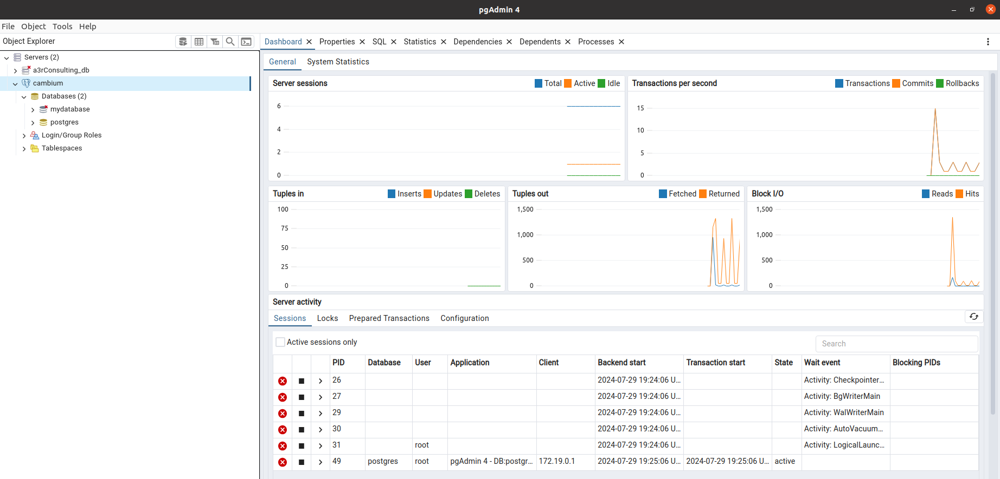
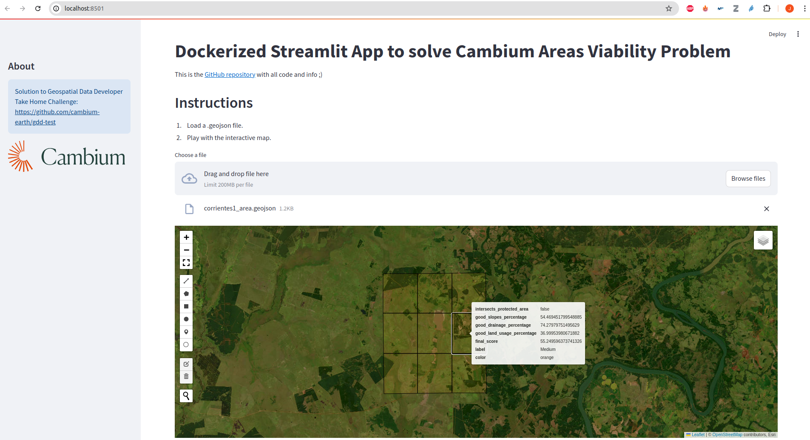

# Cambium Geospatial Data Developer Challenge

This repo provides a possible solution to the challenges proposed in [Geospatial Data Developer Take Home Challenge](https://github.com/cambium-earth/gdd-test).

It is divided in two main folders that answer Parts 1 and 2 in the mentioned repository, respectively:
- For the first part, we just create a docker container that runs PostgreSQL, with PostGIS and h3-pg extensions installed. To check it is running, we connect to the database with PgAdmin.

- For the second part, a streamlit app is being created that allows the user to upload a .geojson file, and plots the output in an interactive map. For simplicity, run `streamlit/examples/areas_suitability.ipynb`!


## Usage:

> If user does not want to install Docker, requirements.txt can be installed in a conda or pip env. Then, either run the streamlit app or check the results using examples/areas_suitability.ipynb!

To run both the PostgreSQL database and the Streamlit application, we just need to:

1. Install [docker](https://docs.docker.com/engine/install/) locally on your PC.
2. Build the images using `docker-compose.yaml`.
```commandline
docker-compose build
```
3. Create the containers and run the services.
```commandline
docker-compose up -d
```
To stop containers, run `docker-compose down`.

To check everything is running properly, we can do `docker ps`, and the output should look like this:
```commandline
CONTAINER ID   IMAGE                        COMMAND                  CREATED          STATUS                    PORTS                                       NAMES
434d17caf1f0   cambium-homework-streamlit   "streamlit run app.p…"   13 minutes ago   Up 13 minutes (healthy)   0.0.0.0:8501->8501/tcp, :::8501->8501/tcp   app_cambium
a53e06a28dcf   cambium-homework-postgres    "/usr/local/bin/init…"   13 minutes ago   Up 13 minutes             0.0.0.0:5432->5432/tcp, :::5432->5432/tcp   postgres_cambium
```

Containers are running, but we just need to authenticate to Google Earth Engine. To do this, we have to create a project in [this link](https://earthengine.google.com/). When the project is created, paste the name in the corresponding variable in `streamlit/cambiame-app/src/config.py`, changing other config related variables if needed.

After changing the configuration when project is created, execute the streamlit container, to access its bash session. In this case, we do:
```commandline
docker exec -it 434d17caf1f0 /bin/bash
```
but replace the **id** with your container **id**.
Finally, run `earthengine authorize` and follow terminal instructions.

You should be all set to access your application in [0.0.0.0:8501](0.0.0.0:8501)!

## Questions and Conclusion

As a summary, I will briefly try to explain the approach I have followed to solve this challenge.

The first part involves the creation of a docker container, running a PostgreSQL service, so I decided to create a Dockerfile, and run the container using docker-compose.

For the second part, I decided to create a tiny streamlit application, as I really like the results UX, and it is very pythonic.
Regarding the scientific or technical considerations for the areas classification, I followed the constraints in the challenge instructions. To apply these constraints, I calculate the different percentages of suitable pixels in the provided area given different assumptions, dividing the area in random sub-areas, and then summing them app to calculate a global `final score`.
Moreover, I discarded protected areas, and areas where the land usage is wetlands or forests are penalized.

- What kind of aspects would you take into account if you were assigned with the task of implementing this type of analysis at scale?

In the current solution, we are not using a Database to dinamically store the downloaded or generated files, as the area is quite small, and we rejected that option for simplicity. In the case we want to study bigger areas, I would connect the application with PostgreSQL, or any other geospatial friendly database, that will store the used datasets in different formats and resolutions, so the access to the data is faster and more consistent. In the current case, we depend on API connections to the Google Earth Engine API, for example, and we want to avoid external dependencies on our production environment.
Apart from the data storage, I think the rest of the assumptions will perfectly work with bigger areas and datasets. The selected libraries, as ee, geemap or xarray, are thought to work with huge datasets, and have parallelisable backends that perfectly handle big data querys and proccessings. Finally, streamlit and docker are very easy to use frameworks that really facilitate the deployment.

- How can you ensure that the output result is consistent over time and responds to the data quality business users expect?

Regarding data quality, we are now just downloading data real time, and hoping the data downloaded is consistent. To ensure data quality consistency over time, I would recommend the creation of periodic jobs that download and store the data in our production database, so we do not depend on a single and independent download, but have a track record for all data downloaded from the different resources, confirming the data used is consistent.
To this end, bunch of tools as Airflow, or even simple cronjobs, can be a good tool.

- If one or more of the input data sources vary with time by their nature (e.g., land use change, deforestation, etc.), how would you approach this challenge? How can we compare the results of the analysis today vs a few months ago?

Again, if we want to handle changes in the data over time, because of the data nature, we should always associate study results and analysis to time metadata. Then, if we extract conclusions for a report generated with data at time t, and we want to compare the results with a report generated at time t + 5 months, we will know the data we have used in both cases, which will be ideally stored in the database. We will also be able to explain differences, and replicate both studies at anytime.